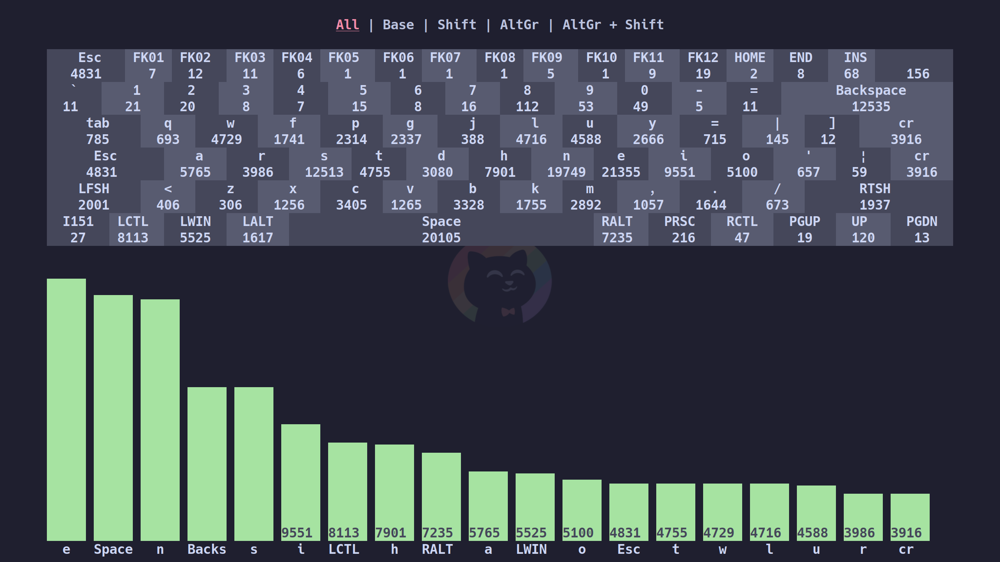

<a name="readme-top"></a>

<!-- PROJECT SHIELDS -->
<!--
*** I'm using markdown "reference style" links for readability.
*** Reference links are enclosed in brackets [ ] instead of parentheses ( ).
*** See the bottom of this document for the declaration of the reference variables
*** for contributors-url, forks-url, etc. This is an optional, concise syntax you may use.
*** https://www.markdownguide.org/basic-syntax/#reference-style-links
-->
[![Contributors][contributors-shield]][contributors-url]
[![Forks][forks-shield]][forks-url]
[![Stargazers][stars-shield]][stars-url]
[![Issues][issues-shield]][issues-url]
[![MIT License][license-shield]][license-url]


<!-- PROJECT LOGO -->
<br />
<div align="center">
  <a href="https://github.com/tetsugakusha256/key-viewer">
    
  </a>

<h3 align="center">key-viewer</h3>

  <p align="center">
    project_description
    <br />
    <a href="https://github.com/tetsugakusha256/key-viewer"><strong>Explore the docs »</strong></a>
    <br />
    <br />
    <a href="https://github.com/tetsugakusha256/key-viewer">View Demo</a>
    ·
    <a href="https://github.com/tetsugakusha256/key-viewer/issues">Report Bug</a>
    ·
    <a href="https://github.com/tetsugakusha256/key-viewer/issues">Request Feature</a>
  </p>
</div>


<!-- TABLE OF CONTENTS -->
<details>
  <summary>Table of Contents</summary>
  <ol>
    <li>
      <a href="#about-the-project">About The Project</a>
      <ul>
        <li><a href="#built-with">Built With</a></li>
      </ul>
    </li>
    <li>
      <a href="#getting-started">Getting Started</a>
      <ul>
        <li><a href="#prerequisites">Prerequisites</a></li>
        <li><a href="#installation">Installation</a></li>
      </ul>
    </li>
    <li><a href="#usage">Usage</a></li>
    <li><a href="#roadmap">Roadmap</a></li>
    <li><a href="#contributing">Contributing</a></li>
    <li><a href="#acknowledgments">Acknowledgments</a></li>
  </ol>
</details>


<!-- ABOUT THE PROJECT -->
## About The Project

[![Overall statistics][product-screenshot1]]
[![Per key statistics][product-screenshot2]]
[![Heatmap key usage repartition][product-screenshot3]]


<p align="right">(<a href="#readme-top">back to top</a>)</p>


### Built With

* [![Rust][Rust.org]][Rust-url]

<p align="right">(<a href="#readme-top">back to top</a>)</p>

<!-- GETTING STARTED -->
## Getting started

```sh
cargo build
```

### Prerequisites

This is an example of how to list things you need to use the software and how to install them.
* cargo

### Installation

1. Clone the repo
   ```sh
   git clone https://github.com/tetsugakusha256/key-viewer.git
   ```
2. Compile
   ```sh
   cargo build --release
   ```
3. Setup key aquisition via the 2 possible options.
   Key aquisition only save the number of presses per key and key pairs.
  1. Interception tool
  2. Stat logger deamon


<p align="right">(<a href="#readme-top">back to top</a>)</p>


<!-- USAGE EXAMPLES -->
## Usage

Use this space to show useful examples of how a project can be used. Additional screenshots, code examples and demos work well in this space. You may also link to more resources.

_For more examples, please refer to the [Documentation](https://example.com)_

<p align="right">(<a href="#readme-top">back to top</a>)</p>


<!-- ROADMAP -->
## Roadmap

- [ ] Feature 1
- [ ] Feature 2
- [ ] Feature 3
    - [ ] Nested Feature

See the [open issues](https://github.com/tetsugakusha256/key-viewer/issues) for a full list of proposed features (and known issues).

<p align="right">(<a href="#readme-top">back to top</a>)</p>


<!-- CONTRIBUTING -->
## Contributing

Contributions are what make the open source community such an amazing place to learn, inspire, and create. Any contributions you make are **greatly appreciated**.

If you have a suggestion that would make this better, please fork the repo and create a pull request. You can also simply open an issue with the tag "enhancement".
Don't forget to give the project a star! Thanks again!

1. Fork the Project
2. Create your Feature Branch (`git checkout -b feature/AmazingFeature`)
3. Commit your Changes (`git commit -m 'Add some AmazingFeature'`)
4. Push to the Branch (`git push origin feature/AmazingFeature`)
5. Open a Pull Request

<p align="right">(<a href="#readme-top">back to top</a>)</p>


<!-- ACKNOWLEDGMENTS -->
## Acknowledgments

* []()
* []()
* []()

<p align="right">(<a href="#readme-top">back to top</a>)</p>


<!-- MARKDOWN LINKS & IMAGES -->
[contributors-shield]: https://img.shields.io/github/contributors/tetsugakusha256/key-viewer.svg?style=for-the-badge
[contributors-url]: https://github.com/tetsugakusha256/key-viewer/graphs/contributors
[forks-shield]: https://img.shields.io/github/forks/tetsugakusha256/key-viewer.svg?style=for-the-badge
[forks-url]: https://github.com/tetsugakusha256/key-viewer/network/members
[stars-shield]: https://img.shields.io/github/stars/tetsugakusha256/key-viewer.svg?style=for-the-badge
[stars-url]: https://github.com/tetsugakusha256/key-viewer/stargazers
[issues-shield]: https://img.shields.io/github/issues/tetsugakusha256/key-viewer.svg?style=for-the-badge
[issues-url]: https://github.com/tetsugakusha256/key-viewer/issues
[license-shield]: https://img.shields.io/github/license/tetsugakusha256/key-viewer.svg?style=for-the-badge
[license-url]: https://github.com/tetsugakusha256/key-viewer/blob/master/LICENSE.txt
[linkedin-shield]: https://img.shields.io/badge/-LinkedIn-black.svg?style=for-the-badge&logo=linkedin&colorB=555
[linkedin-url]: https://linkedin.com/in/linkedin_username
[Rust.org]: https://img.shields.io/badge/Rust-000000?style=for-the-badge&logo=rust&logoColor=white
[Rust-url]: https://rust-lang.org
[product-screenshot1]: images/pic1.png
[product-screenshot2]: images/pic2.png
[product-screenshot3]: images/pic3.png
